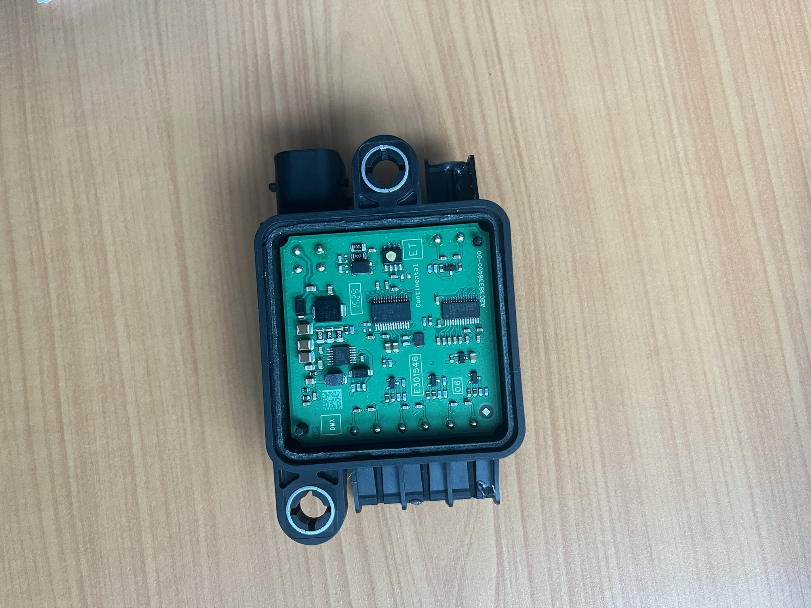

### Reálná aplikace Continental HTS (High Temperature Sensor)

#### Popis

Snímač vysokých teplot ve výfukovém systému nakladních automobilů: [web](https://www.cummins.com/news/2025/04/23/frequently-asked-questions-epa27-aftertreatment-system)

#### Obrázky

#### Podklady

1. [Datasheet k použitému mikroprocesoru](pic18f26-ds.pdf)
