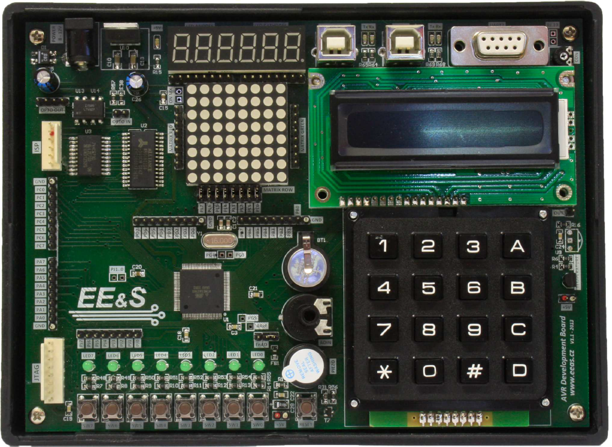

### Kit AVR_DevBrd

#### Popis

Kit pro práci s mikroprocesorem Microchip (AVR) řady Atmega 2560, vývojový kit je vybavený LEDkami, teplotním snímačem, externí pamětí SRAM a EEPROM, LCD displejem, bzučákem, tlačítky, a mnohým dalším.

Obsazen:

1. Mikroprocesor Microchip řady AVR Atmega 2560

- Cena kitu (2025/09): není známa, odhaduji původní cenu na cca 5000 Kč
- Orientační cena 1ks mikroprocesoru (2025/09): 200 Kč (mouser.cz, kusová cena!)

2. Kit je předprogramován bootloaderem a program se nahrává pomocí PC aplikace pro MS Windows přes USB rozhraní (tj.není potřeba klasický debugger typu Atmel-ICE, ale nelze samozřejmě klasicky debuggovat program atd., lze pouze nahrát a spustit):
   1. aplikace pro MS Windows: [xmega-bootloader_v_rev3.0.zip](xmega-bootloader_v_rev3.0.zip)
   2. obsah paměti mikroprocesoru: [bootloader-target_v-x.zip](bootloader-target_v-x.zip) 

#### Obrázky

Nejsou

#### Podklady

1. Návod: [pdf](avr-devbrd-man_v1.1.pdf)
2. Elektrické schéma: [pdf](avr-devbrd-sch_rev1.pdf)
3. Device datasheet: [pdf](atmega640-1280-1281-2560-2561-ds_v-2020-05.pdf)
4. Errata sheet: [pdf](atmega640-1280-1281-2560-2561-er_v-2023-02.pdf)
5. Program lze vyvíjet např.ve vývojovém prostředí Microchip Studio, prostředí poskytuje i omezené možnosti simulátoru na PC.
