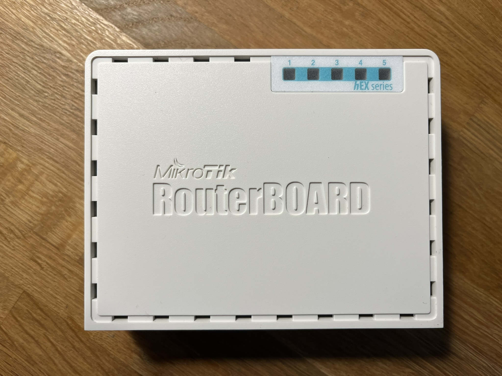
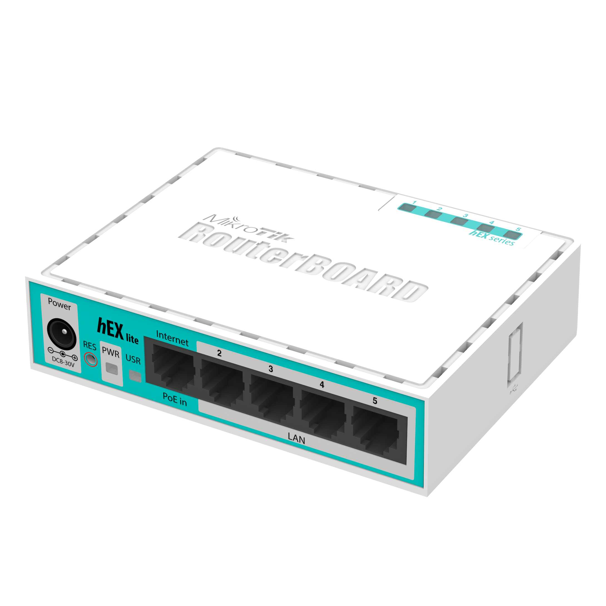
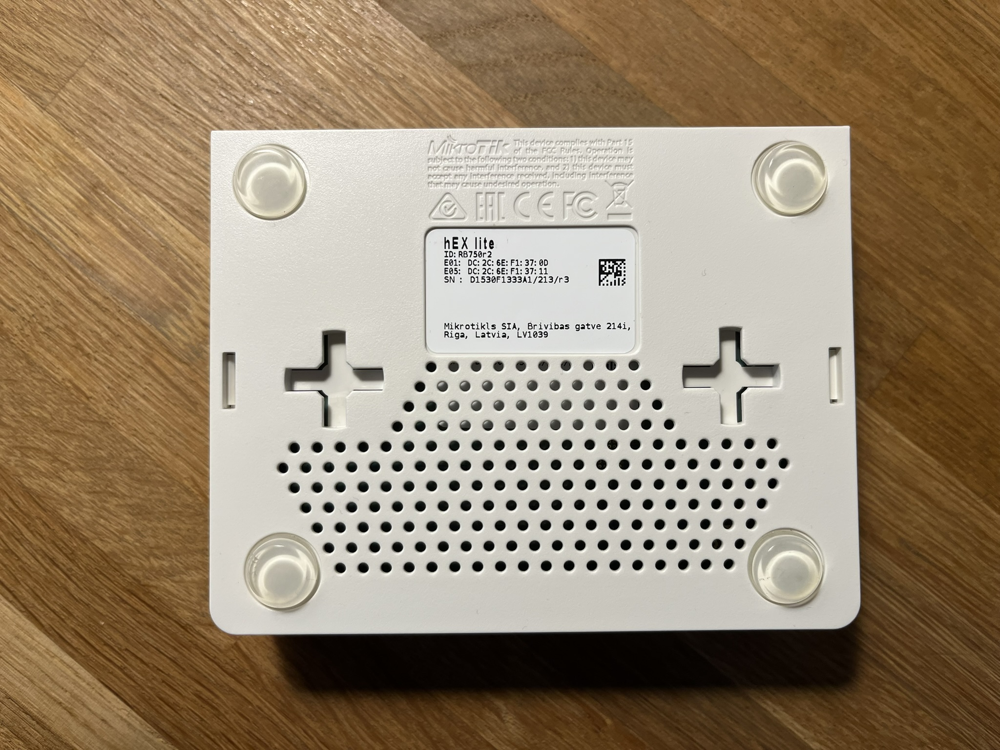
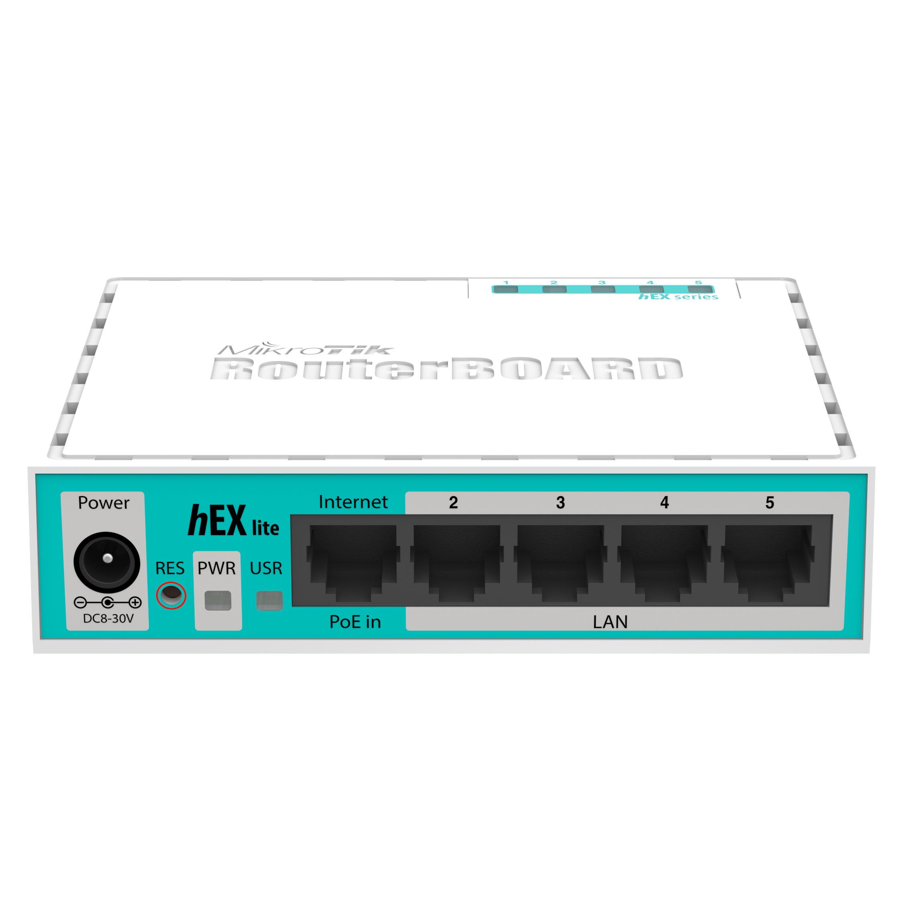
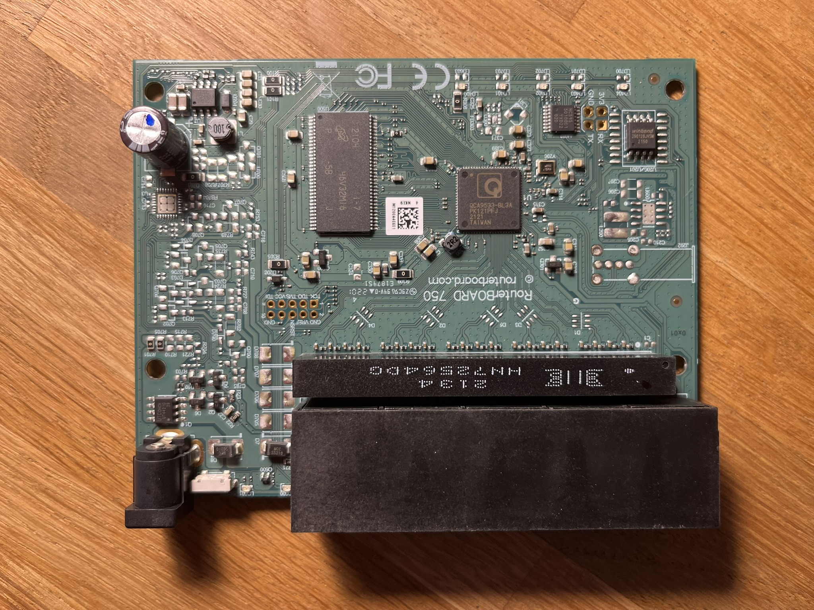

### 5-port ethernet router

#### Popis

Není, viz. Podklady

Obsazen:

1. [QCA9533, system-on-a-chip (SoC)](https://www.qualcomm.com/products/technology/wi-fi/qca9531)

#### Obrázky

#### Podklady

1. [Datasheet](mikrotik-hexlite-rb750r2-ds.pdf)
