### Učebna V2

#### Popis

Učebna je vybavena racky (2ks skříně) s vybavením síťových komponent od CISCO a MIKROTIK, kabeláží/konektory k pracovním stolům (skříň <-> PC stoly), a PC s několika síťovými rozhraními (pozor: učebna je využívána i pro jinou výuku je třeba zachovat nastavení adapterů pro běžnou internetovou konektivitu, toto rozhraní se jmenuje obvykle "WAN", nastavení tohoto adaptéru neměnit, pro účely naší výuky v předmětu POS, postačí odpojit a znovu připojit např. kabel pokud je to nezbytné z povahy cvičení)

Každá skříň obsahuje zhruba tuto sestavu 4 krát (tj. učebna celkově 2 skříně x 4 = 8 krát):

- [CISCO CATALYST 3560-C Series POE](https://www.cisco.com/c/en/us/support/switches/catalyst-3560-c-series-switches/series.html): 2x
- [CISCO CATALYST 2960 Series](https://www.cisco.com/c/en/us/support/switches/catalyst-2960-series-switches/series.html): 2x
- [CISCO 2901](https://www.cisco.com/c/en/us/support/routers/2900-series-integrated-services-routers-isr/series.html): 1x
- [CISCO 1941](https://www.cisco.com/c/en/us/products/collateral/routers/1900-series-integrated-services-routers-isr/data_sheet_c78_556319.html): 1x
- [CISCO ASA 5505 Series](https://www.cisco.com/c/en/us/products/collateral/security/asa-5500-series-next-generation-firewalls/datasheet-c78-733510.html): 1x
- [MIKROTIK RouterBoard 1100 X2 AH](https://mikrotik.com/product/RB1100AHx2): 2x

#### Obrázky

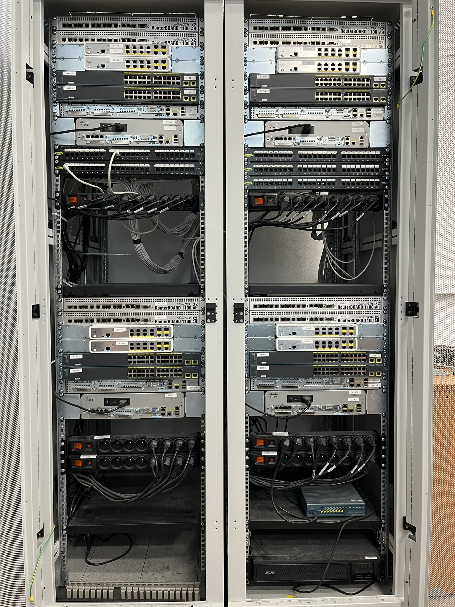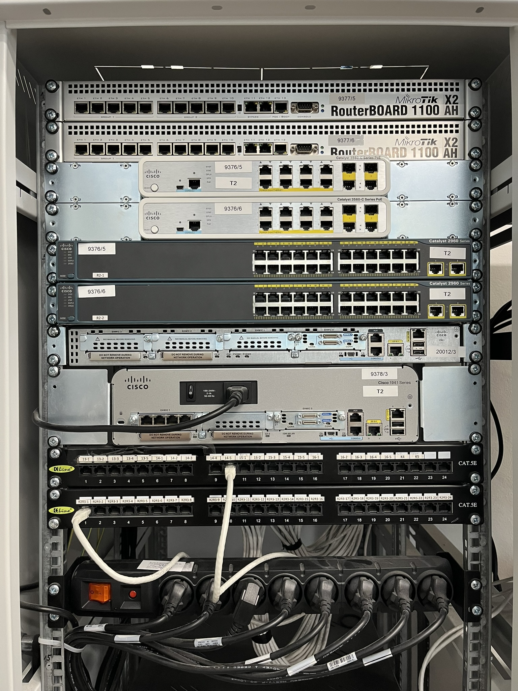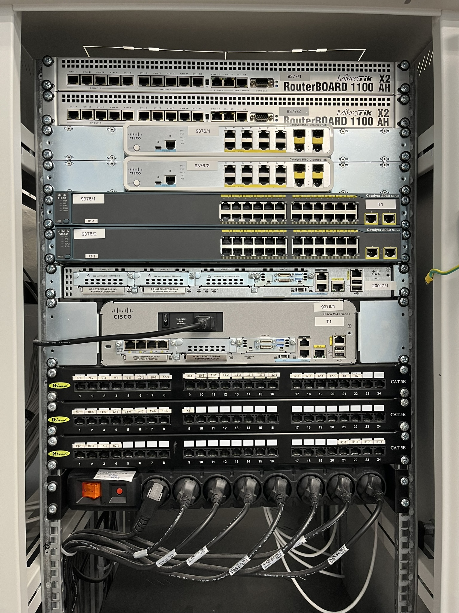
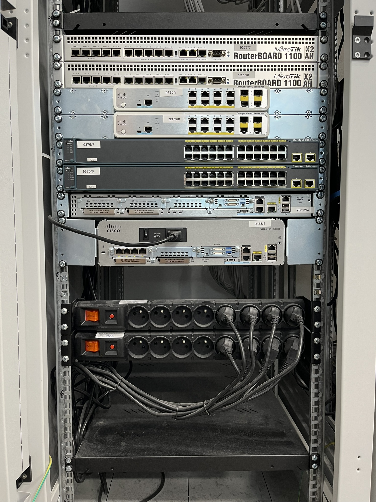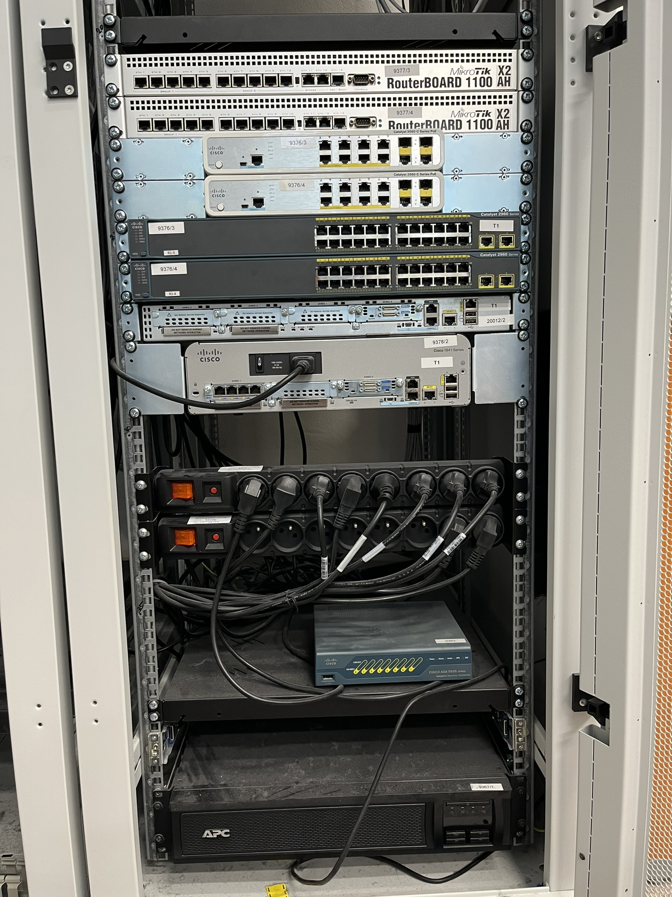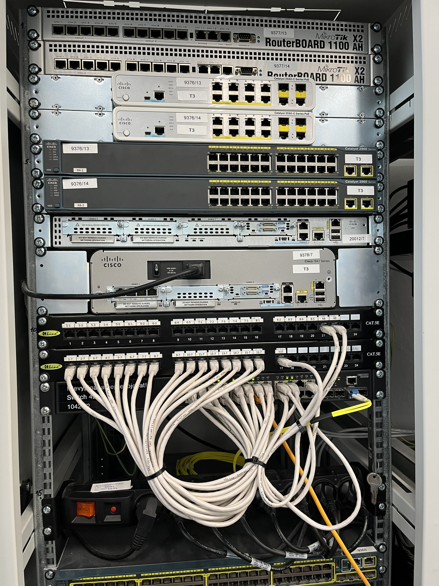
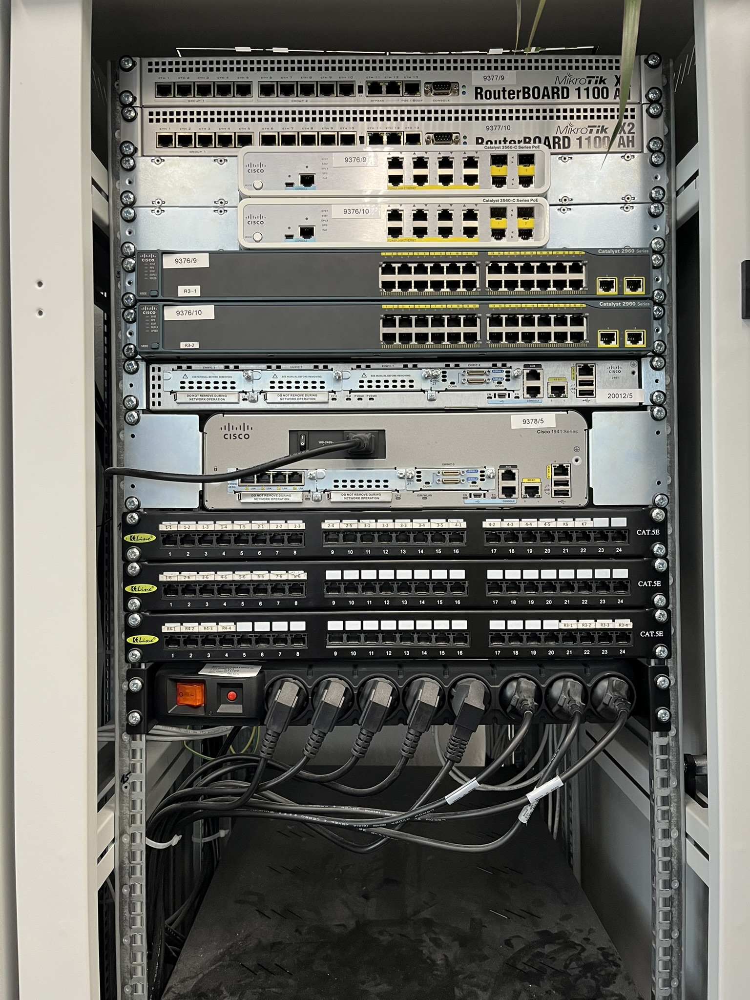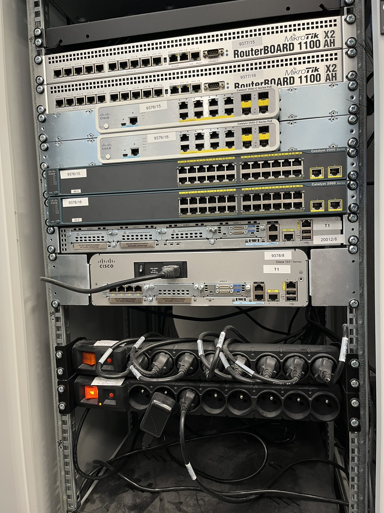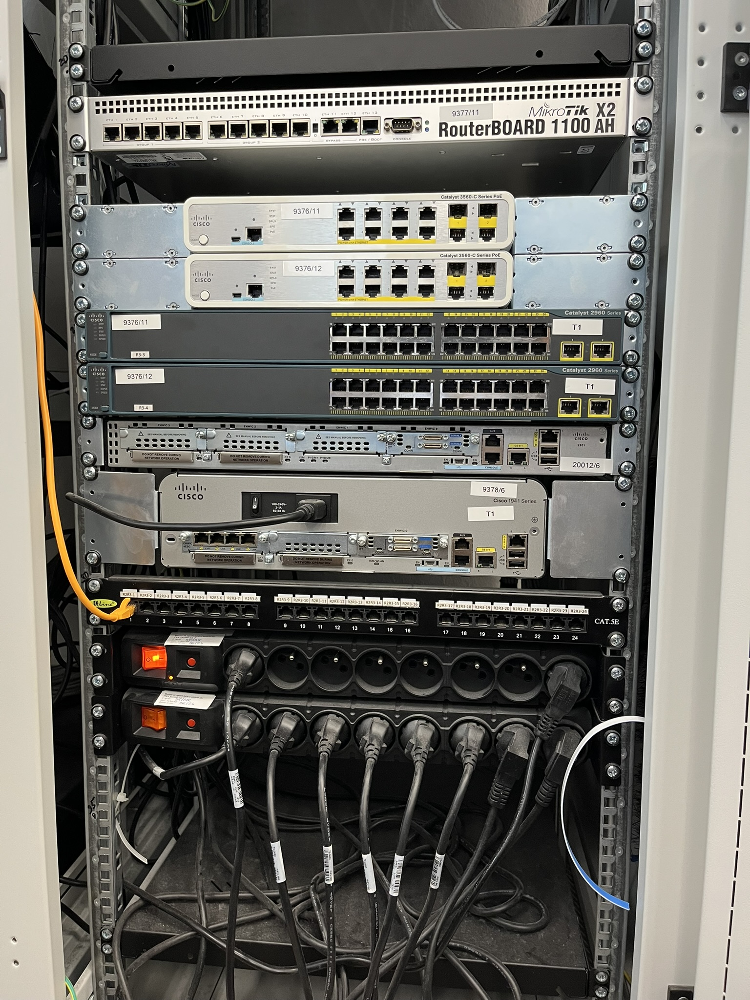
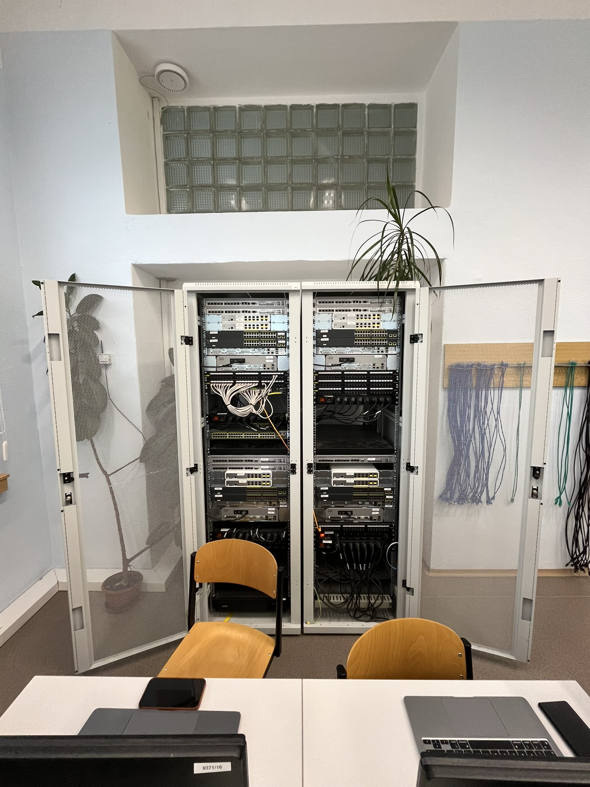

#### Pravidla a tipy

- V případě nutností hraní s hesly používáme pouze dvě: "cisco" nebo "class", žádné jiné, dále neukládáme trvale konfigurace do non-volatilní paměti u jednotlivých zařizení, pokud ano, správný postup je před odchodem z učebny nastavit zařízení do defaultu od výrobce (tj.proces reload defaultní konfigurace) 
- Nezdá se vám v pořádku stav zařízení?: zkontrolujte jeho stavové indikátory (LED), typicky správný stav po dokončení boot sekvence je trvalá zelená u LEDek: SYST a STAT
- do PC je potřeba se přihlásit pomocí osobního účtu, ten Vám zajistí, že budete tzv. síťoví administrátoři tj. můžete měnit nastavení síťových adapterů (opět: neměnit nastavení adaptéru "WAN")
- pokud se zařízení ptá po připojení např. přes konzoli na tzv. "initial configuration" doporučení je No, tj. neprocházet tento konfigurační průvodce
- pokud po připojení např. přes konzoli k zařízení nepozorujete žádnou aktivitu je třeba stisknout např.jednou klávesu "Enter" a počkat na zobrazení promptu od zařízení (pravděpodobně jste se připojili, již po dokončené boot sekvenci a zařízení aktivně naslouchá na nové příkazy)

#### Upozornění

V učebně se řeší nefunkčnost propoje/či zdířky ("14 nefunguje zdířka 7 na internet") u jednoho pracoviště a je nutné ponechat zapojené kabely 2ks (oranžové), jedná se o propoje: 14-5 na R2R3-1 a dále do hlavního WAN switche 10425/2, viz.fotky:

 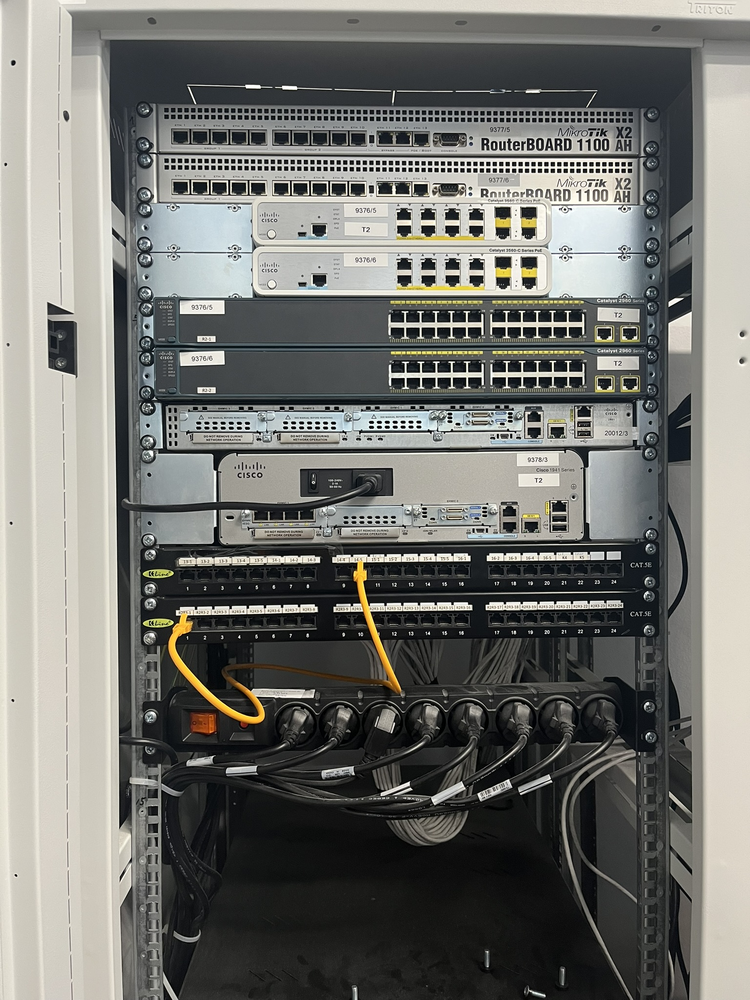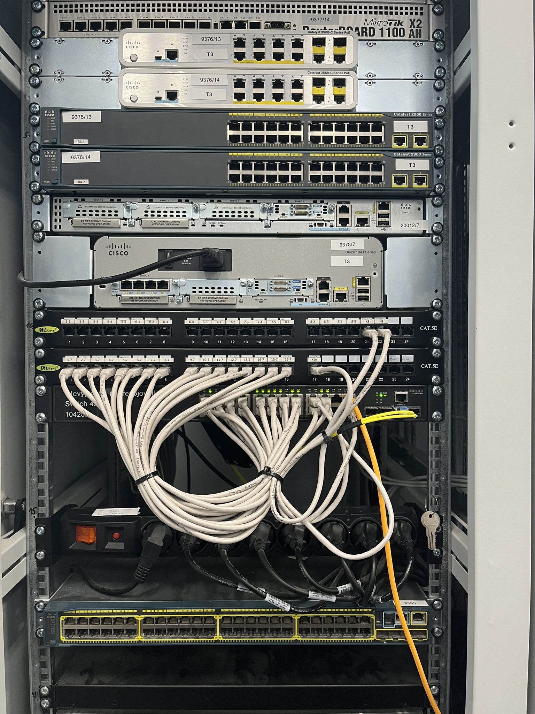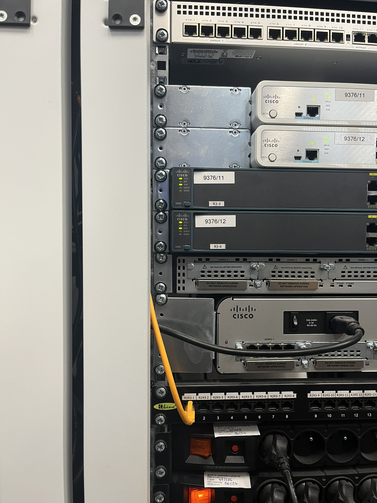
