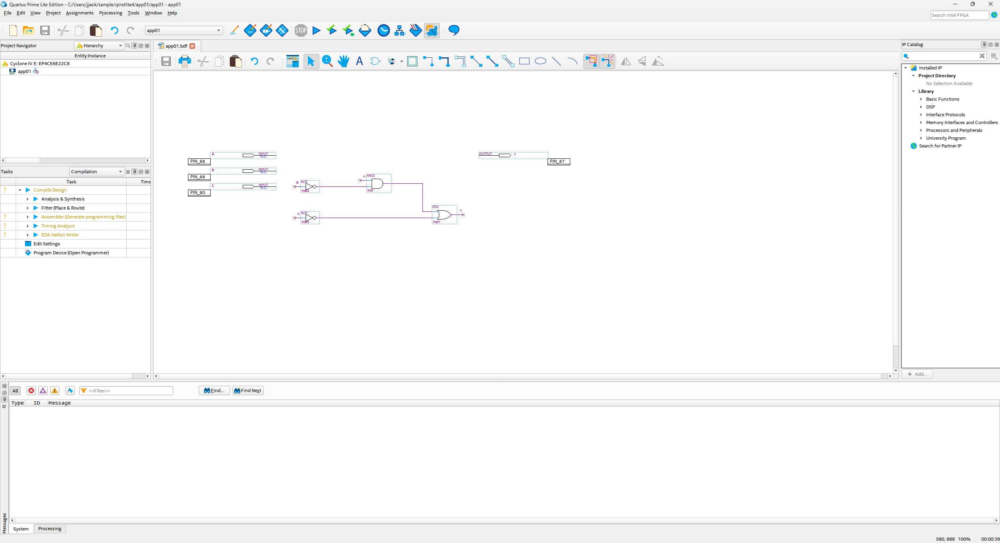
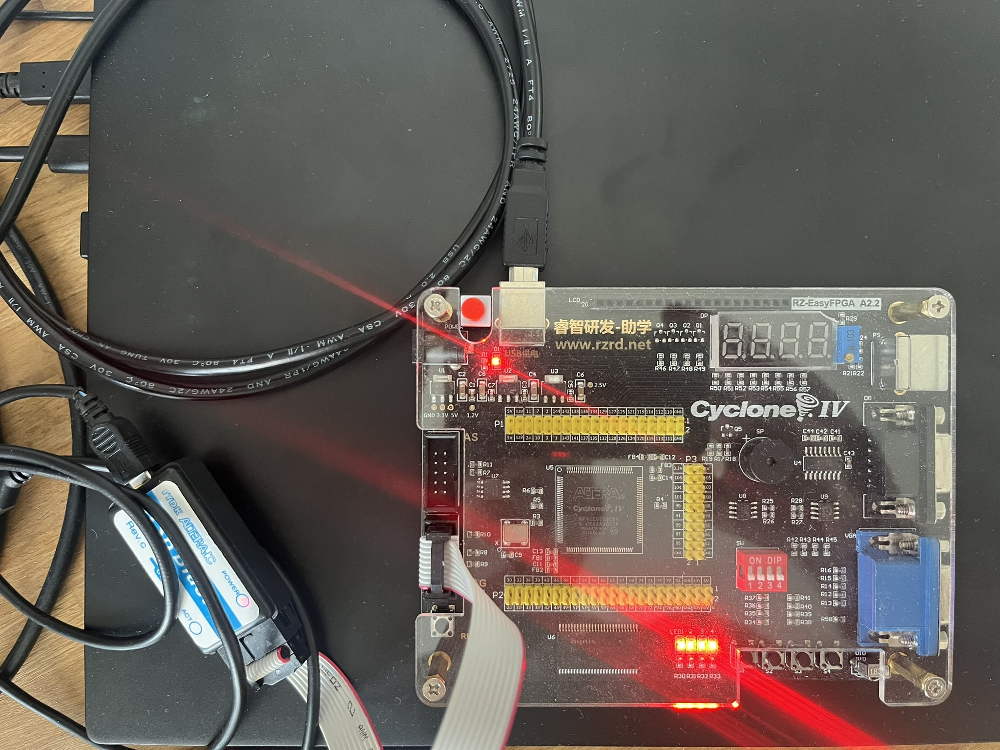

### Zprovoznění nástrojů, jednoduchá úloha

#### Doporučení

1. Pracovat lze samostatně či po dvojicích.
1. Pokud je něco nejasné hned se ptejte.
1. Pozor: Nástroje se v různých verzích drobně liší.

#### Cíle

1. Vytvoření projektu (vytvoření, uložení, načtení)
2. Vytvoření jednoduché logické kombinační funkce pro hradlového pole pomocí nástroje pro tvorbu schématu (tzv. BDF: Board Design File)
3. Kompilace a řešení případných chyb v návrhu
4. Ověření funkce pomocí funkční simulace
5. Ověření funkce pomocí časové simulace
6. Přiřazení vstupů/výstupů funkce na fyzické piny hradlového pole (funkce: Pin Planner)
7. Nahrání konfigurace do reálného hradlového pole
8. Ověření funkce na reálném hradlovém poli
9. Bonus: prozkoumání projektových souborů: např. zjištění kolik LE (Logic Element) bylo použito apod. statistiky

#### Návodka

1. [Quartus Tutorial with Basic Graphical Gate Entry and Simulation](unifl-bdf-tutorial_v-2022-05-07-r0a.pdf)
Pozor: Ne všechny kroky jsou pro nás relevant (krok přeskakujeme), některé detaily mohou být drobně jinak (rozdílné verze nástroje a jeho GUI), některé části mohou být nejasné (krok přeskakujeme), pozor: používáme jinou součástku hradlového pole, která má jinou množinu fyzických pinů, snažil jsem se do textu dát Sticky notes u těchto bodů ;-)
2. BDF screenshot logické funkce

3. Ukázka zapojení kitu (napájení a USB Blaster)

#### Alternace (další možnosti)

TODO