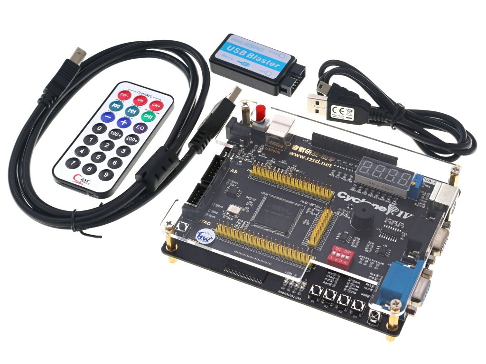

### Kit OMDAZZ

#### Popis

Kit pro práci s obvodem FPGA EP4CE6, vývojový kit je vybavený LEDkami, teploměrem, pamětí SDRAM a EEPROM, konektory pro displej LCD, bzučákem, tlačítky, IR přijímačem a mnohým dalším.

Obsazen:

1. FPGA Altera Cyclone IV **EP4CE6E22C8N**

Cena: cca 3000 Kč

#### Obrázky

 

#### Podklady

1. [Návod](omdazz-manual_v-x.pdf)
2. [Elektrické schéma jako pdf](omdazz-schematic_v2014-12-09.pdf)
3. [Rozvržení pinů pro FPGA jako jpg](omdazz-pin-table_v-x.jpg)
4. [Rozvržení pinů pro FPGA jako pdf](omdazz-pin-table_v-x.pdf)
5. [Rozvržení pinů pro FPGA jako xls](omdazz-pin-table_v-x.xls)

#### Doporučení

1. Nastavit nepoužívané piny jako "input tri-stated", např.v prostředí Quartus Prime: Assignments/Device/Device and Pin Options/Unused Pins (ve verzi 24.1std je toto jako default: "As input tri-stated with weak pull-up")